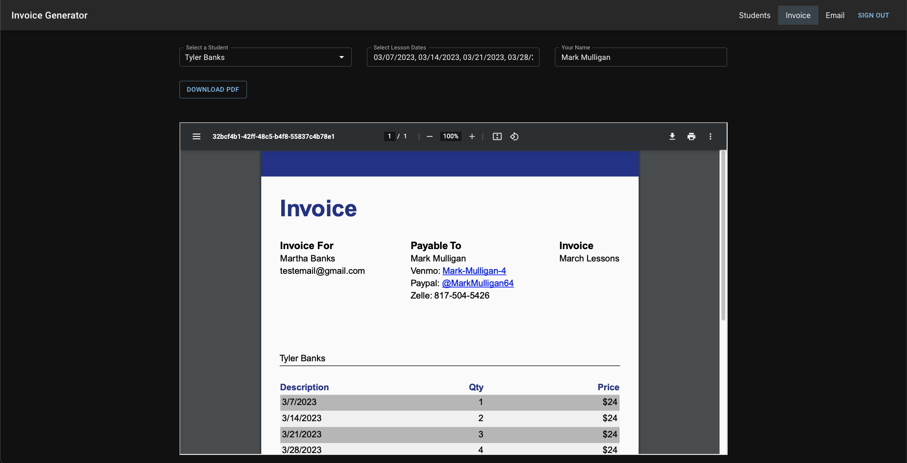
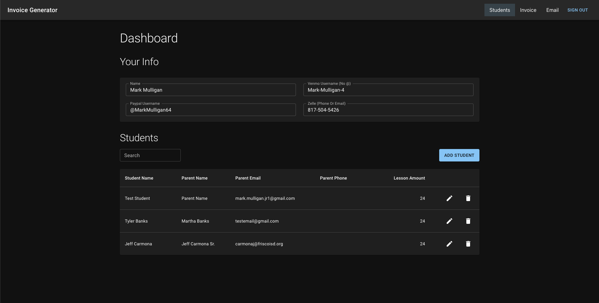
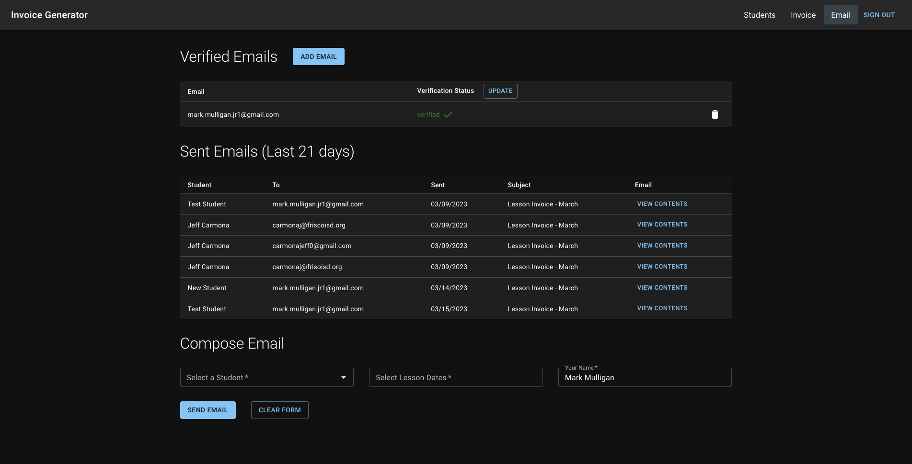

# Invoice Generator

## Description

I built this application for one of my friends who is a private music teacher. He spends a lot of time putting together invoices for the parents of the students he teachers each month. This program is designed to streamline that process. I also included a way to save and organize a roster of students. This data is present to the user in the form of table to can be easily searched and sorted. I used google oauth to login in the users, firebase to store all the necessary data, and the react-pdf package to create and generate professional invoices that can be downloaded and used as needed. I am using serveral services from AWS (API Gateway, Lambdas, SNS, SES) to handle the email portion of the application which also invoices emails to be sent directly from the application.

The goal of reducing the amout of time need to produce invoices was meet with this project. It use to take my friend about 2 hours to do invoices for all of his students. He can now complete the same task in about 20 minutes (83% improvement).

### View the Project Live  

https://lesson-invoice-generator.netlify.app/

#### Built With

- Next.js
- Typescript
- [MUI](https://mui.com/)
- Firebase
- AWS (SES, SNS, Lamdbas, API Gateway)
- [NextAuth](https://next-auth.js.org/)
- [@react-pdf/renderer](https://www.npmjs.com/package/@react-pdf/renderer)

## Develope Locally

### Firebase Setup

You will need to create a new project [firebase project](https://firebase.google.com/). They are many docs available online to get you started with this. The main thing we will be doing is firebase is using the firestore database. After creating your firebase project, setup the firestore database. The nice thing about firestore is the nessary collections will be created automatically, all you need to do is be connected the database.

The firebase setup needs to be done before being able to run the app since NEXT-Auth will be leveraging your firestore database for authentication. While you can run the firestore database locally, I prefer to develope with the cloud version as it makes deploment way easier since everything is already integrated.

### Next Auth

After setting up the firebase project with firestore database, you enter all the environment variables seen in the .env.example to get NextAuth working (except the aws env variables are not needed for this part). These environment variables are mostly related the the firebase project and can be found there.

### Next.js

After getting firebase and next auth setup, go ahead and install all the npm packages in the root directory of the project.

`npm install | yarn install ` etc.

To run in development mode, run the following command:

`npm run dev | yarn run dev`;

If everything is setup correctly, the project should run and allow you to login.

### AWS

This is a seperate add on for the email feature. I will need to add these docs later as there is a lot of development that has been done directly in AWS to set this up. The project should work without this, you just won't be able to use the emails page.

## Technical Overview

This project leverages Next.js to allow me to do both server and client logic in the same app. This replaces the need for me to extract backend logic to a sperate node.js backend. I also utizlied material ui to leverage prebuilt react components. I like to use material UI when a have a project with a need for a lot of data driven components such as advanced inputs and tables.

#### Authentication

For Authenication, I leveraged the NextAuth library. This library integrates well with Next.js because it has built in hooks to access session data on the front end as well as functions that can access this session data in the backend as well (Get Static Props functions etc.). NextAuth also handles a lot of the boiler plate in terms of storing and working with sessions in a database. I used the NextAuth Adapter to connect to my firebase account as well as the google auth provider, allowing for easier set up of OAuth2 with google (No more hashing and storing passwords or other sensitive data).

#### Generating PDFs

I used the react pdf library to generate pdfs in the browser. This library also allow me to use react components to style the pdf templates as well, making it easy to make the disign I wanted for the invoices. Being able to leverage react to make the pdfs also allowed me to update the pdfs based on the user input. That is how I was able to quickly render the pdf to the user based on their input data.

As far as sending the pdfs in emails, I first extra the blob data from the pdf and then encoded it in a base64 string. I then sent this string to an api route in AWS, to then be passed onto AWS SES in the form of the email. I also used this string to store the pdfs in firebase so that they can be viewed later by a user. I decided to go this route because all my user data was already stored in firebase and this allowed me to easily associated pdfs with users without a lot of additional components.

#### Emails

Emails are a feature that I added to this project at a later time. The goal was to add onto the project without changing any of the existence of the original application. Because of this, I ended up developing most of the email logic as a microservice in AWS.

For the email microservice, I created a basic api using AWS API Gateway and lambda functions. I created routes that handle all the logic of registering emails, interacting with SES, and handling sending email delivery verification. To secure the api, I used an api key to protect all my routes. My next.js application uses this api key on the backend to connect to my AWS Api, thus only my application can use this api.

The logic for sending the emails themselves is a lamda that leverages both AWS SES and Nodemailer library. I was able to create a transport and send emails via a post request utilizing these libraries. I was also able to add an sns topic to listen for successfully deliveries made by the clients email address. Upon a successful delivery, the SNS topic trigger a lambda function that then sends an email to the user confirming their invoice was delivered successfully.

## Usage

#### Dashboard Page

- This page allows you to manage both your personal information on the invoices along with the all the students in your lesson studio.

#### Invoice Page

- This page allows you to quickly create invoices. These invoices can be downloaded to be saved for later or sent with an email.

#### Email Page

- This page allows you to send emails from the application. First, register an email you own. Then you can fill out the form at the bottom of this page to begin sending emails with invoices. It's as simple as that.

## Contact

[My Github](https://github.com/Mark-Mulligan)  
mark.mulligan.jr1@gmail.com  
[Linkein](https://www.linkedin.com/in/mark-mulligan-50)  
[Portfolio](https://markmulligan.dev)

#### How to Contact Me

Feel free to reach out to me if you have any questions about this project. You can email me using the email listed above or can go to my github page to view my other projects and portfolio.

© Mark Mulligan 2023 All Rights Reserved.
